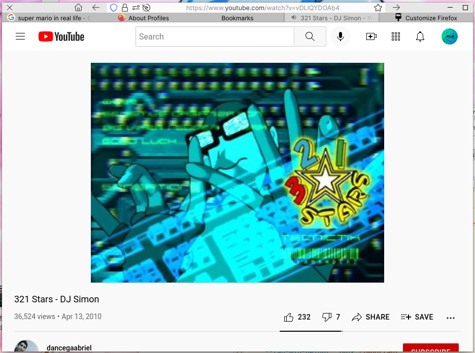

# praqticalfox
A two-line, although very compact, Firefox CSS theme, with editable options for Windows, Mac, and Elementary OS.

It probably has glitches idk

 

(The tab bar hides when there's only one tab)

It also has support for themes downloaded from the Firefox store

# How to install:
1) Download my theme by clicking on the green button with the text "Code" at the top of this page
2) Open Firefox, and enter "about:config" in the URL bar
3) In about:config, search for "ui.prefersReducedMotion" - it's likely that nothing will show up, so create that key as a number, and set it to 1
4) Also set "toolkit.legacyUserProfileCustomizations.stylesheets" and "browser.compactmode.show" both to "true"
5) Close about:config, right click the empty space on your URL bar, and click "Customize Toolbar..."
6) At the bottom left of the window, click "density" and set it to "Compact (not supported)"
7) Close the customization tab, and open about:profiles
8) There will be 4 buttons, all labeled "Open Directory" - click on the first one
9) In the folder it opened, create a new folder called "chrome"
10) Drag and drop my "userChrome.css" file that you downloaded, into the "chrome" folder you just created
11) Restart Firefox :)

The reason ui.prefersReducedMotion is enabled is because the Safari-style tabs won't center correctly without it. idk why and honeslty I'm just too lazy to fix it

Here's how my "customize Firefox" page is set up, I recommend you set it up the same way

If you're on Mac or Elementary OS, I'd recommend poking around the userChrome.css file, there's options at the bottom of the file to move the window buttons to the left/eOS style
